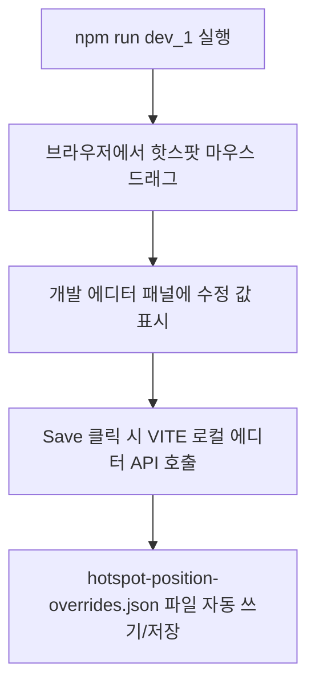

# KINTEX VR Reconstruction

[](https://react.dev/)
[](https://www.typescriptlang.org/)
[](https://threejs.org/)
[](https://vitejs.dev/)
[](https://playwright.dev/)
[](https://tailwindcss.com/)
[](LICENSE)

## 프로젝트 소개
본 프로젝트는 기존에 개발되어 있던 **`VX_WEB_DEMO`** 프로젝트의 핵심 설계를 물려받아, **AR/VR 기반의 실내외 길찾기 및 3D 공간 지도(Pathfinding Map Navigation) 기능**을 별도로 고도화하여 대폭 강화한 지능형 VR 시뮬레이션 프레임워크입니다. 

**K-MICE KINTEX VR** 투어의 파노라마 웹뷰어를 현대적인 웹 기술 스택(React, TypeScript, Three.js, Vite)으로 1:1 정밀 복원하고, 기존의 플래시 또는 krpano 솔루션을 대체하여 WebGL 기반의 유연하고 빠른 3D 구면 좌표 투영 뷰어를 제공하며, 핫스팟의 상대적 각도(ath/atv) 좌표 오차를 최소화하고 E2E 자동화 테스트를 통해 검증 체계를 확보했습니다.

---

## 프로젝트 목적
- **비주얼 정밀 매핑**: 원본 krpano 파노라마 시야와 1:1 완벽 정합성(초기 각도, 시야각, 핫스팟의 화면 내 X/Y 오차 5px 이하)을 달성합니다.
- **체계적 좌표 교정**: Three.js 구면 역좌표계를 기반으로 한 핫스팟 배치 및 드래그 조정 편집기인 Hotspot Editor를 기본 제공하여 실시간 공간 좌표를 수집합니다.
- **E2E 및 비주얼 정밀 회귀 테스트**: 빌드 변경으로 인한 레이아웃 및 핫스팟 편차 발생을 방지하기 위한 Playwright 기반의 비교 E2E 테스트 자동화를 지향합니다.

---

## 프로젝트 특징 & 지원 기능
- **90+ Panorama Scenes**: 킨텍스 전시홀 및 상공(항공 씬)을 아우르는 전체 90여 개 고해상도 구면 파노라마 리소스 렌더링.
- **Three.js WebGL Viewer**: flipped sphere geometry `scale(-1, 1, 1)` 기반의 3D 공간 구면 투영 제어.
- **Hotspot Navigation**: 씬 이동(`nav`), 정보 표시(`info`), 랜드마크 마킹(`poi`) 핫스팟 지원.
- **Information Panel**: 좌측 하단의 탭 전환형(일반정보 / 안전정보 / 공간정보) 시설 상세정보 사이드바 제공.
- **Floor Navigation / Selector**: 층별/구역별 씬 목록 조회 및 필터 기반 필터링 이동 제어.
- **White Card UI System**: 원본 디자인 언어를 준수하는 화이트 라운드 카드 기반 테마 디자인(White + Black + Red pin).
- **Hotspot Editor**: 브라우저 상에서 핫스팟을 마우스 드래그하여 각도를 맞추고 JSON 오버라이드 코드를 생성하는 전용 모드 탑재.

---

## 프로젝트 스크린샷
> **항공01 씬 렌더링 및 프리미엄 KINTEX 랜드마크 포인터 예시**
> 
> 
> *(상단에서 조망하는 항공01 화면 내 킨텍스 제1/제2전시장 화이트 카드 말풍선 마커 정합성 노출)*

---

# Features
- **Three.js Panorama Viewport**: 구형(Sphere) 구조 공간 회전 및 마우스 드래그를 이용한 3D 가상 회전 제어.
- **Seamless Transition**: ZOOMBLEND 카메라 축소를 연출한 자연스러운 씬 이동 흐름.
- **Premium Custom Pins**: 킨텍스 전시장 전용 화이트 둥근 카드 마커 및 위치 핀 아이콘 제공 (`animate-floaty` 유도).
- **Hotspot Override JSON**: 원본 리소스 갱신 없이, `hotspot-position-overrides.json`을 통하여 실시간 위치 편차 즉각 보정.

---

# Technology Stack

| Category               | Technology  | Version   | Purpose                              |
| :--------------------- | :---------- | :-------- | :----------------------------------- |
| **Core Library**       | React       | `^18.3.1` | UI 및 컴포넌트 렌더링 관리           |
| **Bundler / Tooling**  | Vite        | `^6.3.5`  | 개발 서버 및 프로덕션 고속 빌드      |
| **Language**           | TypeScript  | `~5.6.3`  | 정적 타입 검사 및 안정성 확보        |
| **3D Rendering**       | Three.js    | `0.169.0` | WebGL 3D 구면 파노라마 공간 렌더링   |
| **Styling**            | TailwindCSS | `^3.4.17` | 유연한 레이아웃 및 컴포넌트 스타일링 |
| **Testing Framework**  | Playwright  | `^1.61.1` | E2E 기능 자동화 및 테스트 실행       |
| **Linter / Formatter** | Biome       | `1.9.4`   | 코드 품질 검사 및 포맷 제어          |

---

# Project Structure

```text
kmice-vr/
├── dist/                          # 프로덕션 빌드 출력 디렉토리
├── public/                        # 정적 리소스 및 파노라마 배경 이미지
│   └── panos/                     # 로컬 구면 파노라마 JPG 파일 및 메타
├── src/
│   ├── models/                    # 데이터 모델 & 도메인 인터페이스 (M)
│   │   ├── scene.model.ts         # 씬/구역 데이터 모델 및 정적 데이터셋 재내보내기
│   │   ├── hotspot.model.ts       # 핫스팟 구조 및 교정 좌표 사전 모델
│   │   ├── info.model.ts          # 시설정보 탭 메타데이터 및 유니온 타입
│   │   └── editor.model.ts        # 드래그/클릭 에디터 인터랙션 모델
│   ├── services/                  # 비즈니스 핵심 API & 도메인 룰 서비스
│   │   ├── scene.service.ts       # 씬 리스트 필터링 및 노출 조건 제어 서비스
│   │   ├── hotspot.service.ts     # 안전장치 연계 핫스팟 노출 조건 계산 서비스
│   │   ├── override.service.ts    # 에디터 로컬 파일 저장/초기화 REST 서비스
│   │   └── translation.service.ts # 다국어 번역 데이터 및 레이블 사전 서비스
│   ├── controllers/               # 이벤트 연동, 브라우저 API 및 상태 제어 핸들러 (C)
│   │   ├── navigation.controller.ts # 씬 이동 및 층/구역 스위칭 조정기
│   │   ├── info.controller.ts     # 시설정보 사이드바 개폐 및 활성 탭 제어기
│   │   ├── editor.controller.ts   # 핫스팟 드래그 캡처 및 REST API 트랜잭션 처리기
│   │   ├── scene.controller.ts    # 자동 투어 타이머 루프 및 전체화면 상태 제어기
│   │   └── hotspot.controller.ts  # 가시성 규칙 필터링 전담 제어기
│   ├── views/                     # 비즈니스 로직과 분리된 순수 JSX 마크업 및 스타일 (V)
│   │   ├── AppView.tsx            # 최상위 뷰 및 VR 프레임 렌더러
│   │   ├── FloorSelectorView.tsx  # 층/구역 선택 리스트 슬라이더
│   │   ├── InfoPanelView.tsx      # 시설 정보 드로어 패널 템플릿
│   │   ├── MiniMapView.tsx        # 미니맵 방위계 그래픽 렌더러
│   │   ├── SceneDropdownView.tsx  # 씬 드롭다운 메뉴 레이아웃
│   │   ├── VRControlsView.tsx     # 우하단 VR/전체화면 버튼 컨테이너
│   │   └── PanoramaView.tsx       # Three.js 캔버스 영역 및 핫스팟 레이어 투영 뷰
│   ├── components/                # 뷰 컴포넌트 중개용 Delegate (Controller Wrapper)
│   │   ├── FloorSelector.tsx
│   │   ├── InfoPanel.tsx
│   │   ├── InfoTabs.tsx
│   │   ├── KintexLogo.tsx
│   │   ├── MiniMap.tsx
│   │   ├── PanoramaViewer.tsx     # Three.js WebGL 뷰어 초기화 및 마운트 위임
│   │   ├── SceneDropdown.tsx
│   │   ├── TopNav.tsx
│   │   ├── TutorialOverlay.tsx
│   │   └── VRControls.tsx
│   ├── utils/                     # 극좌표 변환, 타입 가드, 에디터 로거 등 공통 유틸
│   │   ├── panoramaProjection.ts  # NDC 투영 및 삼각함수 구면각(Latitude/Longitude) 변환
│   │   ├── logger.ts              # 핫스팟 좌표 실시간 로그 수집기
│   │   └── guards.ts              # 안전 폼 인풋 유효성 검사 가드
│   ├── index.css                  # 글로벌 스타일 및 글래스/화이트 카드 스타일
│   ├── main.tsx                   # 애플리케이션 엔트리 포인트
│   └── vite-env.d.ts              # Vite 환경 타입 정의
├── tests/
│   ├── e2e/                       # Playwright E2E 검증 스펙
│   └── visual-audit/              # 비주얼 테스트 스크린샷 및 JSON 보고서
├── tsconfig.json                  # TypeScript 설정 파일
├── vite.config.ts                 # Vite 환경 설정 파일
└── package.json                   # 종속성 라이브러리 및 실행 스크립트 정의
```

---

# Architecture (MVC Pattern)
본 프로젝트는 기존의 복잡한 모놀리식 단일 파일 구조에서 유지보수성, 테스트성 및 확장성을 극대화하기 위해 완전한 **MVC (Model-View-Controller) 아키텍처**로 전환되었습니다.

- **Model (src/models)**: 씬 데이터, 구역(Zone), 핫스팟 오버라이드, 에디터 조작에 사용되는 데이터 스키마 및 정적 데이터 컬렉션을 명세합니다.
- **View (src/views)**: React 컴포넌트의 모든 상태 변화 및 부수 효과(Effect) 코드가 전무한 100% 프리젠테이션 컴포넌트로 구성됩니다. 스타일 변경 및 DOM 계층 구조 배치에만 집중합니다.
- **Controller (src/controllers & src/components)**: React의 커스텀 훅 및 상태 전달자 구조를 띠고 있으며, 타이머 루프, PointerEvent 리스너, REST API 통신 등을 수행하여 Model과 View를 완전히 격리·중개합니다.
- **Services (src/services)**: 도메인 비즈니스 논리(예: "특정 씬에서 어떤 조건일 때 안전 정보 탭이 켜져야 하는가?", "특정 문장의 번역 규칙은 어떻게 매핑되는가?")를 순수 자바스크립트 서비스 레이어로 위임하여 테스팅을 쉽게 만듭니다.

---

# Installation

### Prerequisites
- Node.js (`v18` 이상 권장) 또는 Bun 설치.

### 패키지 설치 방법
```bash
# 의존성 패키지 설치
npm install
# 또는
bun install
```

---

# Development

### 일반 개발 모드 실행
```bash
npm run dev
# 또는
bun run dev
```
- 기본 실행 포트: `http://localhost:5173/`
- 마우스 드래그를 이용해 파노라마 뷰어를 제어하고 하단 탭 및 우측 사이드바로 씬 간 이동이 가능합니다.

---

# Hotspot Editor

**Hotspot Editor**는 3D 공간 상의 핫스팟 ath/atv 오차를 실시간 마우스 드래그로 보정하고 설정 값을 추출하는 정밀 개발 도구입니다.



### 실행 방법
```bash
npm run dev_1
```

### 지원 기능
- **Drag Edit**: 화면의 핫스팟을 마우스로 붙잡고 끌어 원하는 방향(ath, atv)으로 위치를 자유롭게 이동시킵니다.
- **Click Test**: 드래그 편집 모드와 실제 클릭 시나리오 작동성을 교차 테스트(`Click Test`)할 수 있습니다.
- **Save**: 수정한 단일 핫스팟 정보를 로컬 환경 overrides JSON 파일에 기록합니다.
- **Reset**: 보정된 수치를 공장 초기화하여 원본 `scenes.ts` 기본값으로 복구시킵니다.
- **Export JSON**: 현재 씬 전체 및 프로젝트 내 모든 변경 사항을 클립보드에 JSON 형식으로 직관 복사합니다.

### 일반 실행과 에디터 모드 차이점

| 구분               | 일반 모드 (`npm run dev`) | 에디터 모드 (`npm run dev_1`)                |
| :----------------- | :------------------------ | :------------------------------------------- |
| **핫스팟 드래그**  | 불가능 (클릭 액션만 동작) | 가능 (마우스 포인터 드래그로 이동)           |
| **개발자 제어 바** | 미노출                    | 화면 좌측 상단 Dev Edit Panel 노출           |
| **JSON 파일 쓰기** | 불가능                    | 가능 (Save / Reset 시 로컬 디스크 파일 수정) |

---

# Build

파노라마 웹 리소스를 프로덕션에 배포하기 위해 빌드 패키징을 생성합니다.

```bash
npm run build
# 또는
bun run build
```
- 빌드 결과물은 `dist/` 폴더 내에 생성되며 정적 HTML/JS/CSS 자원으로 배포 가능합니다.

---

# Panorama Data

파노라마 데이터는 씬 정보 및 연결된 핫스팟의 좌표, 유형을 객체 지향 형태로 정의합니다.

### 데이터 구조 명세 (`scenes.ts` 예시)
```json
{
  "id": "aerial01",
  "ko": "항공01",
  "en": "Aerial View 01",
  "index": "01",
  "zone": "aerial",
  "img": "/panos/aerial01.jpg",
  "startLon": 350,
  "startLat": -5,
  "hotspots": [
    {
      "id": "aerial01-h11",
      "lon": 348.77,
      "lat": -6.29,
      "label": "KINTEX1",
      "labelEn": "KINTEX1",
      "kind": "nav",
      "target": "lobby5",
      "url": "/mice/upload/mice_vr/KIN/air/kor/SIC2027 KINTEX_Exhibition_1_kor.png"
    }
  ]
}
```

- `startLon` / `startLat`: 씬 진입 시 카메라가 바라보는 초기 수평(atv) 및 수직(ath) 정적 각도.
- `lon` / `lat`: 3D 구면 내부 투영 각도(크기: $0$ ~ $360$도 / $-90$ ~ $90$도).
- `kind`: 핫스팟 유형 (`nav` = 씬 이동, `poi` = 위치 랜드마크, `info` = 정보 모달).

---

# Hotspot Override System

좌표 보정값이 렌더링에 적용되는 우선순위(Priority)는 다음과 같습니다:

```text
[우선순위 1] hotspot-position-overrides.json (실시간 에디터 조율 수치)
      │
[우선순위 2] src/data/scenes.ts (정적 개발 기본 선언 좌표)
      │
[우선순위 3] 3D 투영 구체 기본값 (0, 0)
```

---

# Testing

Playwright 테스트 스펙을 통하여 로컬 사이트의 정합성을 검증합니다.

### 실행 명령
```bash
# 전체 테스트 실행
npx playwright test

# 특정 Parity 비교 스펙만 실행
npx playwright test tests/e2e/kintex-vr-all-scenes-position-parity.spec.ts
```

### 테스트 종류
- **Visual Parity Test**: 원본 사이트와 로컬 사이트의 뷰포트 내 핫스팟 좌표 오차가 5px 이하인지 검증.
- **Floor Controls Test**: 좌/우측의 층수 탭 이동 시 올바른 구역 및 타겟 씬으로 네비게이션이 분기 처리되는지 검증.
- **KINTEX Pin Verifier**: 항공 씬 내 KINTEX 제1/제2전시장 핀 포인터 노출 및 Fallback 렌더링 검증.

---

# Performance
- **Selective Texture Loading**: 씬 교체 시에만 `TextureLoader`를 통해 파노라마 이미지를 지연(Lazy) 로드하여 브라우저 초기 로딩 속도 극대화.
- **Flipped Geometry Scale**: Sphere scale `(-1, 1, 1)` 처리를 통해 3D 텍스처 데이터 미러링을 원천 최소화하고 렌더링 코스트 축소.
- **Debounced Interaction**: 마우스 드래그 관성(inertia) 계산 시 가벼운 감쇄율 상수(`0.93`)를 사용해 CPU 부하 경감.

---

# Troubleshooting

### Q1. 킨텍스 제1/제2전시장 말풍선 핀이 투명하게 사라집니다.
- **원인**: 원본 외부 CDN 이미지 주소 차단 또는 Mixed Content 에러 발생.
- **해결**: `isKintexPin` 판정 및 이미지 에러 감지 시 동작하는 자체 CSS 둥근 카드 Fallback 렌더러가 탑재되어 있어, 자동으로 로컬 대체 핀이 둥둥 뜨는 애니메이션(`animate-floaty`)과 함께 화면에 갱신됩니다.

### Q2. 층수 버튼 클릭 시 씬이 180도 반대 방향을 가리킵니다.
- **원인**: 구면 좌표계 투영 시 horizontal theta 부호 규칙 어긋남.
- **해결**: `PanoramaViewer.tsx` 내 투영 좌표 공식을 `x = -sin(theta)`, `z = -cos(theta)`로 통일하여 해결했습니다.

---

# License
This project is licensed under the MIT License - see the [LICENSE](LICENSE) file for details.

---

# Contributors
- **VX WEB Team (CTC DX)**
