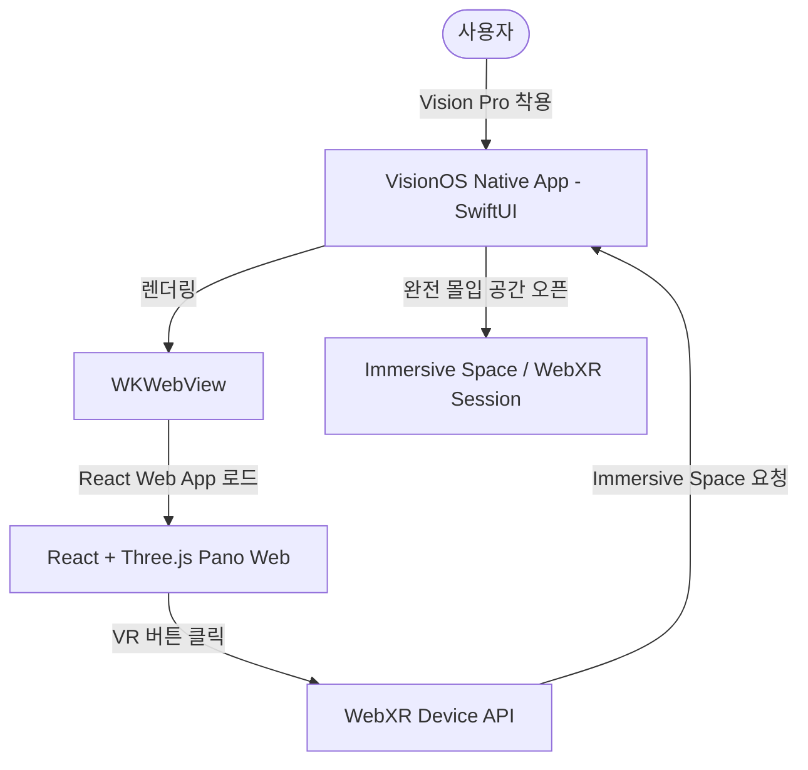

# VisionOS Hybrid App Integration Plan (Web to Vision Pro Simulator)

이 문서는 기존 **React + Three.js** 기반의 360 Panorama Web 앱을 Apple Vision Pro에서 실행하고, **WebXR**을 통해 **Immersive Space(완전 몰입형 공간)**로 진입할 수 있도록 하는 하이브리드 앱 기획 및 실행 로드맵입니다.

---

## 1. 아키텍처 개요 (Architecture Overview)

기본적으로 VisionOS 네이티브 앱(SwiftUI)에서 `WKWebView`를 띄워 웹 콘텐츠를 렌더링하고, 사용자가 VR 진입 버튼을 누르면 Three.js의 WebXR 기능을 활성화하여 Vision Pro의 Immersive Space 공간으로 몰입형 3D 뷰를 전환합니다.



---

## 2. 주요 연동 기획 및 고려사항

### A. WebXR 지원 설정
* **Safari 및 WKWebView의 WebXR 지원**: visionOS의 `WKWebView`는 iOS와 달리 WebXR 및 WebGL2를 기본적으로 고성능 지원합니다. 다만 Xcode 프로젝트 설정에서 카메라/자이로센서 및 Immersive Space 관련 plist 권한을 적절히 설정해야 합니다.
* **Three.js VR 모드 활성화**: 현재 웹 코드에서 일반 마우스/터치 드래그로 조종하는 OrbitControls 외에, `renderer.xr.enabled = true`를 선언하고 XR 컨트롤러/핸드트래킹 데이터를 카메라에 동기화해야 합니다.

### B. 사용자 인터랙션 (Interaction)
* **2D Window Mode (일반 탐색)**: 앱 실행 시 윈도우 형태로 웹 화면이 뜨며, 포인터(Gaze & Pinch)로 핫스팟 클릭 및 2D UI 조작이 가능합니다.
* **Immersive Space Mode (VR 모드)**: "VR 시작" 버튼을 누르면 화면 전체가 360 파노라마 구체(Sphere) 내부로 덮여 실제 공간에 들어온 것과 같은 효과를 줍니다. 손가락 핀치 동작이나 핫스팟을 응시하는 것만으로 씬 전환(Portal 이동)이 가능하도록 WebXR Raycaster를 세팅합니다.

---

## 3. 세부 단계별 진행 로드맵

### Phase 1: Web App의 WebXR 대응 (현재 React 프로젝트 수정)
1. **Three.js XR 모듈 적용**:
   * `renderer.xr.enabled = true` 설정 및 Three.js에서 제공하는 `VRButton` 도입.
   * 컨트롤러/핸드트래킹을 인식할 수 있는 `XRControllerModelFactory` 또는 Raycaster 바인딩.
2. **시뮬레이터 테스트 환경 마련**:
   * 웹 브라우저에서 WebXR Emulator Extension 등을 사용해 VR 모드 진입이 정상적으로 작동하는지 사전 검증.

### Phase 2: Xcode VisionOS 하이브리드 프로젝트 생성
1. **Xcode에서 visionOS Target 프로젝트 신규 생성** (SwiftUI 기반).
2. **`WKWebView` 래퍼 컴포넌트 구현**:
   ```swift
   struct VisionWebView: UIViewRepresentable {
       let url: URL
       func makeUIView(context: Context) -> WKWebView {
           let config = WKWebViewConfiguration()
           // WebXR 및 미디어 자동 재생 등 공간 컴퓨팅 최적화 옵션 설정
           config.allowsInlineMediaPlayback = true
           let webView = WKWebView(frame: .zero, configuration: config)
           return webView
       }
       func updateUIView(_ uiView: WKWebView, context: Context) {
           uiView.load(URLRequest(url: url))
       }
   }
   ```
3. **Info.plist 권한 설정**:
   * 공간 환경에서의 센서 데이터 수집을 위한 관련 권한 설정 추가.

### Phase 3: 로컬 테스트 및 시뮬레이터 구동
1. **로컬 개발 서버 연동**: VisionOS 시뮬레이터에서 로컬 IP(예: `http://192.168.x.x:5173`) 또는 Xcode Local Server로 웹 앱 로드.
2. **WebXR 세션 디버깅**: 시뮬레이터 상에서 Immersive Space가 켜지고 손 제스처로 컨트롤되는지 확인.

---

> [!NOTE]
> 다음 단계로 바로 **WebXR 대응을 위한 React 코드 분석 및 Three.js VR 모듈 추가** 작업을 진행할까요? 아니면 Xcode 프로젝트 생성에 필요한 가이드가 더 필요하신가요?
